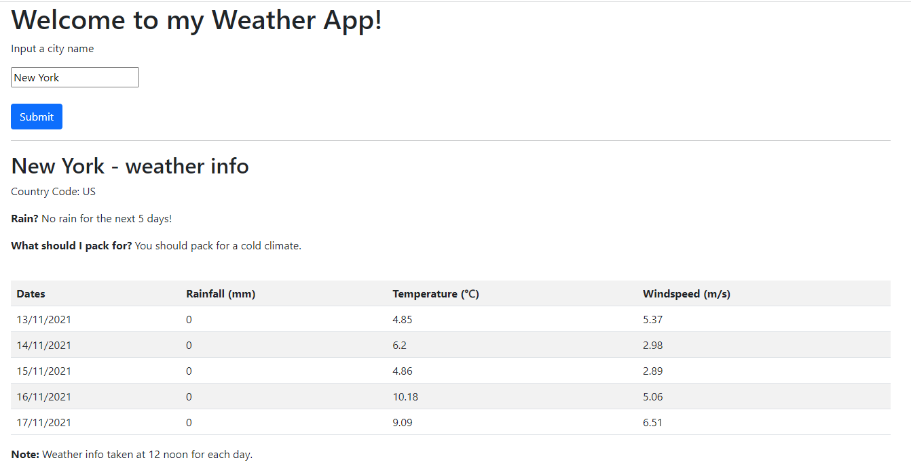

# Reactive Weather App
A client-server web app which gives weather info using an api from https://openweathermap.org/api.

## Run

```npm start```

Open http://localhost:8000/client.html in your web browser

Enter a city, e.g. "New York", and submit

